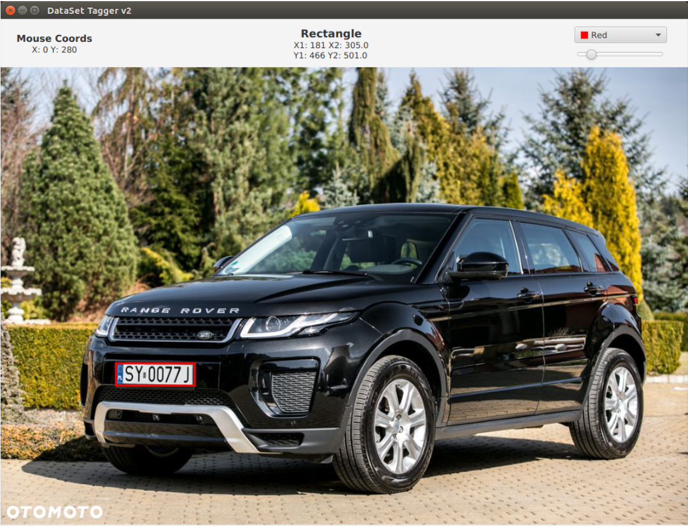

# ImageTagger
Simply program to tag images and returns cords of selected fragment. ImageTagger was used to prepare data to plate detection  ( [link to plate detection project](https://github.com/Kreans/PlateDetection) )

